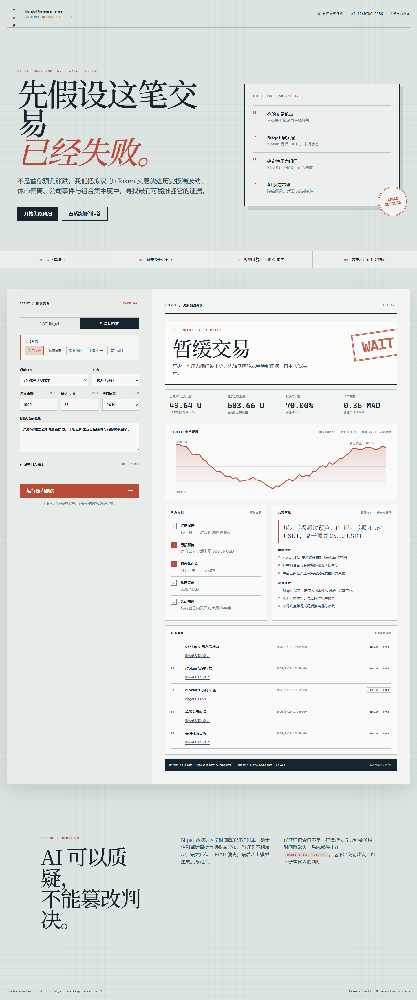
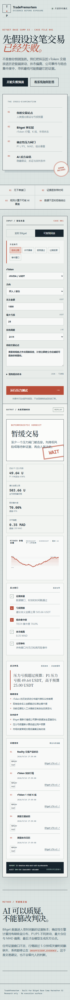

# TradePremortem

**Live Demo:** https://trade-premortem.onrender.com

**GitHub:** https://github.com/congge918/trade-premortem

> 面向 rToken 交易者的 AI 交易失败预演台：在下单前主动寻找反方证据，计算历史极端亏损与组合集中度，并在数据不足时拒绝给出结论。

TradePremortem 是为 Bitget Base Camp Hackathon S2「AI Trading Desk / 决策压力测试」构建的只读研究 Demo。它不预测收益、不连接钱包、不提供下单接口。人类输入拟议交易和最大亏损预算，系统使用 Bitget rToken 数据做确定性压力计算，再由千问生成不能覆盖规则判决的反方解释。

## 界面预览



<details>
<summary>查看 390px 手机端长图</summary>



</details>

## 为什么不是另一个交易信号工具

大多数交易助手从“该不该买”开始。TradePremortem 从“假设已经失败，最可能怎么失败”开始：

1. **事实层**：Bitget UTA v3 的 Reality instruments、ticker、1H candles、美国市场状态/日历、公司概览、估值、盈利预测与停复牌状态。
2. **压力层**：检索 3 个历史相似窗口，并计算对应持有期的 P1/P5 不利波动、亏损预算反推仓位、板块集中度和休市 MAD 偏离。
3. **拒答层**：窗口少于 30、ticker 超过 5 分钟或证据时间戳缺失时，输出 `INSUFFICIENT_EVIDENCE`。
4. **AI 层**：千问只生成最强反方论点、隐藏假设和改判条件，不能修改规则引擎的 verdict。
5. **人类层**：输出是 `PROCEED_WITH_LIMITS`、`WAIT` 或 `INSUFFICIENT_EVIDENCE`；三者都不会触发交易。

## 本地运行

要求 Node.js 20+，无第三方运行时依赖。

```bash
npm test
npm start
```

打开 `http://127.0.0.1:4318`。页面启动后会自动运行一个带哈希的 rNVDA 组合集中度回放。

如果本地网络阻止 Node 直连 Bitget，系统会保留错误原因并自动切换为 `REPLAY`；部署环境仍需重新通过实时数据验收。

赛期千问配置只允许放在服务端环境变量中：

```powershell
$env:BITGET_QWEN_API_KEY="your_server_side_key"
$env:QWEN_BASE_URL="https://hackathon.bitgetops.com/v1"
$env:QWEN_MODEL="qwen3.8-max"
npm start
```

默认使用 Bitget 赛期 Responses API。未配置或调用失败时，界面明确显示“规则回退 · 未调用模型”，不会把模板结果伪装成模型输出。
密钥只应配置在 Render Secret 或本机环境变量中，不得写入仓库、前端代码、日志或提交材料。

重新采集公开 Bitget 快照和生成完整案例记录：

```bash
npm run capture
npm run case-study
```

`data/replay-snapshots.json` 保存四个 rToken 的规范化真实快照和来源哈希。人为价格偏离、事件假设或缺失时间戳均单独显示为 `SCENARIO · INFERENCE`，不会伪装成 Bitget 事实。

## API

### `POST /api/stress-tests`

```json
{
  "replayId": "rnvdausdt-concentration",
  "proposal": {
    "symbol": "RNVDAUSDT",
    "side": "BUY",
    "notionalUsdt": 1000,
    "horizonHours": 24,
    "riskBudgetUsdt": 25,
    "thesis": "美股常规盘之外出现新信息，计划立即建立仓位捕捉可能的价格重估。",
    "portfolio": [
      { "symbol": "RNVDAUSDT", "notionalUsdt": 500 },
      { "symbol": "RAAPLUSDT", "notionalUsdt": 700 },
      { "symbol": "USDT", "notionalUsdt": 1800 }
    ]
  }
}
```

不传 `replayId` 时尝试 Bitget 实时数据；实时请求失败会切换为显著标记的时间戳回放。其他接口：

- `GET /api/replays`：公开回放目录。
- `GET /api/stress-tests/{id}`：在当前服务进程内复查报告。
- `GET /api/health`：运行状态、模型配置与 `executionEnabled: false` 边界。

## 已验证结果

2026-09-14 本地执行：

- 19/19 自动化测试通过。
- 16 个固定案例的判决和核心原因一致率：100%。
- 有效案例证据字段完整率：100%；包含故障注入的全体案例为 97.5%。
- 过期/缺失数据阻断率：100%；错误完成数：0。
- 情景注入正确标注率：100%；历史相似场景覆盖率：100%。
- 四个 rToken 均使用真实 Bitget 规范化快照，每个快照保留 400 根 1 小时 K 线和来源哈希。
- 16 个报告生成 16 个不同审计哈希。
- 公开 Render 已完成 Bitget Qwen `qwen3.8-max` 调用验收：单次公网冒烟测试中，确定性结果约 0.88 秒返回，Qwen 完整分析约 14.8 秒完成，未发生降级或警告。该数字是单次实测，不是延迟分布或成功率统计。
- 千问与普通 LLM 使用同一证据包的正式对照仍未运行，不编造结果。

完整说明见 [EVALUATION.md](./EVALUATION.md)。
完整投研任务记录见 [CASE_STUDY.md](./CASE_STUDY.md)。
真人测试方法与原始记录模板见 [USER_TEST.md](./USER_TEST.md)。

## 数据与安全边界

- 支持 `rAAPLUSDT`、`rNVDAUSDT`、`rGOOGLUSDT`、`rCOINUSDT`。
- 只调用官方文档标注为无需权限、且已在开发环境验证的读接口。
- 不使用需要白名单的 Reality 深度和平台成交接口。
- 不含 API key、账户、钱包、订单、转账或交易代码。
- 回放包含采集时钟、来源 URL 与快照哈希；界面始终显示 `REPLAY`。
- 本项目用于研究展示，不构成投资建议或收益承诺。

## 官方资料

- [Bitget Hackathon S2 参赛手册](https://bitget-ai.gitbook.io/bitgetai_hackathons2/base-camp-hackathon-s2-cn)
- [Bitget UTA Reality Trading Guide](https://www.bitget.com/docs/uta/reality-trading-guide)
- [Bitget UTA Market Data](https://www.bitget.com/docs/catalog/market/market-data)
- [Bitget Agent Hub](https://github.com/Bitget-AI/agent_hub)

`bitget-signal` 启动器已做兼容性探测，但当前 Windows 环境未形成可嵌入本服务的稳定接口，因此没有把它伪装成已完成集成；核心数据链路直接使用官方 UTA API。

## 项目结构

```text
public/             取证实验台界面
src/engine.mjs      确定性压力闸门
src/bitget.mjs      Bitget 只读数据适配器
src/ai.mjs          千问服务端适配与透明回退
src/replays.mjs     真实快照回放、显式情景注入和 16 案例验证集
data/               四个 rToken 的规范化 Bitget 数据快照
artifacts/          可机读的完整投研任务记录
tests/              引擎与服务测试
scripts/evaluate.mjs 量化验证脚本
```

## License

MIT
